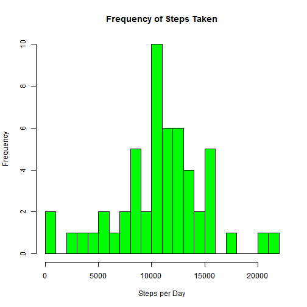
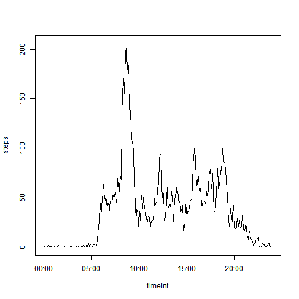
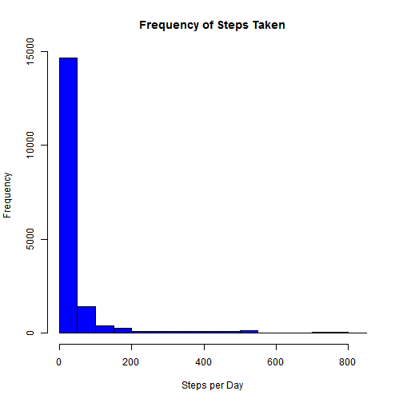
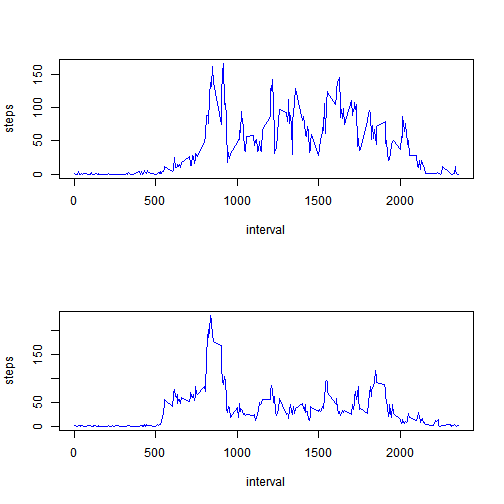

Reproducible Research Peer Assessed, Assignment 1
========================================================

```r
library(knitr); knit("PA1_template.md")
```

```
## 
## 
## processing file: PA1_template.md
```

```
## 
  |                                                                       
  |                                                                 |   0%
  |                                                                       
  |.................................................................| 100%
##   ordinary text without R code
```

```
## output file: PA1_template.txt
```

```
## [1] "PA1_template.txt"
```
## Loading and preprocessing the data

 1. Load the data

```r
activity<-read.csv("activity/activity.csv")
head(activity)
```

```
##   steps       date interval
## 1    NA 2012-10-01        0
## 2    NA 2012-10-01        5
## 3    NA 2012-10-01       10
## 4    NA 2012-10-01       15
## 5    NA 2012-10-01       20
## 6    NA 2012-10-01       25
```

 2. Process/transform the data (if necessary) into a format suitable for your analysis
 remove NA

```r
activityComplete<-activity[complete.cases(activity),]
head(activityComplete)
```

```
##     steps       date interval
## 289     0 2012-10-02        0
## 290     0 2012-10-02        5
## 291     0 2012-10-02       10
## 292     0 2012-10-02       15
## 293     0 2012-10-02       20
## 294     0 2012-10-02       25
```

## What is mean total number of steps taken per day?

 1. Calculate the total number of steps taken per day

```r
library(plyr); library(dplyr)
```

```
## 
## Attaching package: 'dplyr'
## 
## The following objects are masked from 'package:plyr':
## 
##     arrange, count, desc, failwith, id, mutate, rename, summarise,
##     summarize
## 
## The following object is masked from 'package:stats':
## 
##     filter
## 
## The following objects are masked from 'package:base':
## 
##     intersect, setdiff, setequal, union
```

```r
totalsteps<-ddply(activityComplete,"date",summarise,steps=sum(steps))
head(totalsteps)
```

```
##         date steps
## 1 2012-10-02   126
## 2 2012-10-03 11352
## 3 2012-10-04 12116
## 4 2012-10-05 13294
## 5 2012-10-06 15420
## 6 2012-10-07 11015
```

 2. Make a histogram of the total number of steps taken each day

```r
hist(totalsteps$steps,breaks=20,xlab="Steps per Day",main="Frequency of Steps Taken",col="green")
```

 

 3. Calculate and report the mean and median of the total number of steps taken per day

```r
avg<-mean(totalsteps$steps)
med<-median(totalsteps$steps)
avgmed<-data.frame(c("Mean","Median"),c(avg,med))
names(avgmed)<-c("Measure","Number")
print(avgmed)
```

```
##   Measure   Number
## 1    Mean 10766.19
## 2  Median 10765.00
```

## What is the average daily activity pattern?

 1. Make a time series plot (i.e. type = "l") of the 5-minute interval (x-axis) and the average 
 number of steps taken, averaged across all days (y-axis)

```r
library(plyr); library(dplyr)
timeseries<-ddply(activityComplete,"interval",summarise,steps=mean(steps))
time1<-strptime(timeseries$interval[1:12],"%M")
time2<-strptime(paste("0",as.character(timeseries$interval[13:120]),sep=""),"%H%M")
time3<-strptime(timeseries$interval[121:288],"%H%M")
timecol<-c(time1,time2,time3)
timeseries$timeint<-timecol
with(timeseries,plot(timeint,steps,type="l"))
```

 

 2. Which 5-minute interval, on average across all the days in the dataset, 
 contains the maximum number of steps?

```r
strftime(timeseries[which.max(timeseries$steps),3],format="%H:%M")
```

```
## [1] "08:35"
```

## Imputing missing values

 1. Calculate and report the total number of missing values in the dataset 
 (i.e. the total number of rows with NAs)

```r
activityNA<-activity[is.na(activity),]
length(activityNA[,1])
```

```
## [1] 2304
```

 2. Devise a strategy for filling in all of the missing values in the dataset.
 The strategy does not need to be sophisticated. For example, you could use the 
 mean/median for that day, or the mean for that 5-minute interval, etc.
        

```r
        ## Step 1 add a column from timeseries joined on interval to get the average for that interval
timeseriesM<-timeseries[,1:2]
names(timeseriesM)<-c("interval","avgsteps")
activityM<-merge(activity,timeseriesM,by="interval")
activityM<-activityM[with(activityM,order(date,interval)),]
        ## Step 2 If the steps is NA replace it with the AVG for that interval
activityM$stepsC<-activityM$steps
activityM$stepsC[is.na(activityM$stepsC)]<-activityM$avgsteps[is.na(activityM$stepsC)]
        ## Now Column stepsC has complete values if the steps is NA
head(activityM)
```

```
##     interval steps       date  avgsteps    stepsC
## 1          0    NA 2012-10-01 1.7169811 1.7169811
## 63         5    NA 2012-10-01 0.3396226 0.3396226
## 128       10    NA 2012-10-01 0.1320755 0.1320755
## 205       15    NA 2012-10-01 0.1509434 0.1509434
## 264       20    NA 2012-10-01 0.0754717 0.0754717
## 327       25    NA 2012-10-01 2.0943396 2.0943396
```

 3. Create a new dataset that is equal to the original dataset but with the missing data filled in.

```r
activityNew<-activityM[,c("stepsC","date","interval")]
names(activityNew)<-c("steps","date","interval")
head(activityNew)
```

```
##         steps       date interval
## 1   1.7169811 2012-10-01        0
## 63  0.3396226 2012-10-01        5
## 128 0.1320755 2012-10-01       10
## 205 0.1509434 2012-10-01       15
## 264 0.0754717 2012-10-01       20
## 327 2.0943396 2012-10-01       25
```

 4. Make a histogram of the total number of steps taken each day and Calculate and report the mean 
 and median total number of steps taken per day. Do these values differ from the estimates from the 
 first part of the assignment? What is the impact of imputing missing data on the estimates of the 
 total daily number of steps?

```r
totalstepsM<-ddply(activityNew,"date",summarise,steps=sum(steps))
hist(activityNew$steps,breaks=20,xlab="Steps per Day",main="Frequency of Steps Taken",col="blue")
```

 

```r
avgNew<-mean(activityNew$steps)
medNew<-median(activityNew$steps)
avgmedNew<-data.frame(c("Mean","Median"),c(avgNew,medNew))
names(avgmedNew)<-c("Measure","Number")
print(avgmedNew)
```

```
##   Measure  Number
## 1    Mean 37.3826
## 2  Median  0.0000
```

## Are there differences in activity patterns between weekdays and weekends?

 1. Create a new factor variable in the dataset with two levels - "weekday" and "weekend" indicating 
 whether a given date is a weekday or weekend day.

```r
library(chron)
activityNew$wkday<-as.factor(weekdays(as.Date(activityNew$date)))
wkend<-is.weekend(as.Date(activityNew$date))
activityNew$wkend<-wkend
activityNew$wkend<-as.factor(activityNew$wkend)
head(activityNew)
```

```
##         steps       date interval  wkday wkend
## 1   1.7169811 2012-10-01        0 Monday FALSE
## 63  0.3396226 2012-10-01        5 Monday FALSE
## 128 0.1320755 2012-10-01       10 Monday FALSE
## 205 0.1509434 2012-10-01       15 Monday FALSE
## 264 0.0754717 2012-10-01       20 Monday FALSE
## 327 2.0943396 2012-10-01       25 Monday FALSE
```

 2. Make a panel plot containing a time series plot (i.e. type = "l") of the 5-minute interval 
 (x-axis) and the average number of steps taken, averaged across all weekday days or weekend days 
 (y-axis). See the README file in the GitHub repository to see an example of what this plot should 
 look like using simulated data.


```r
library(plyr); library(dplyr)
timeseriesWkend<-ddply(activityNew,c("interval","wkend"),summarise,steps=mean(steps))
par(mfrow=c(2,1))
with(timeseriesWkend[timeseriesWkend$wkend=="TRUE",],plot(interval,steps,type="l",col="blue"))
with(timeseriesWkend[timeseriesWkend$wkend=="FALSE",],plot(interval,steps,type="l",col="blue"))
```

 
